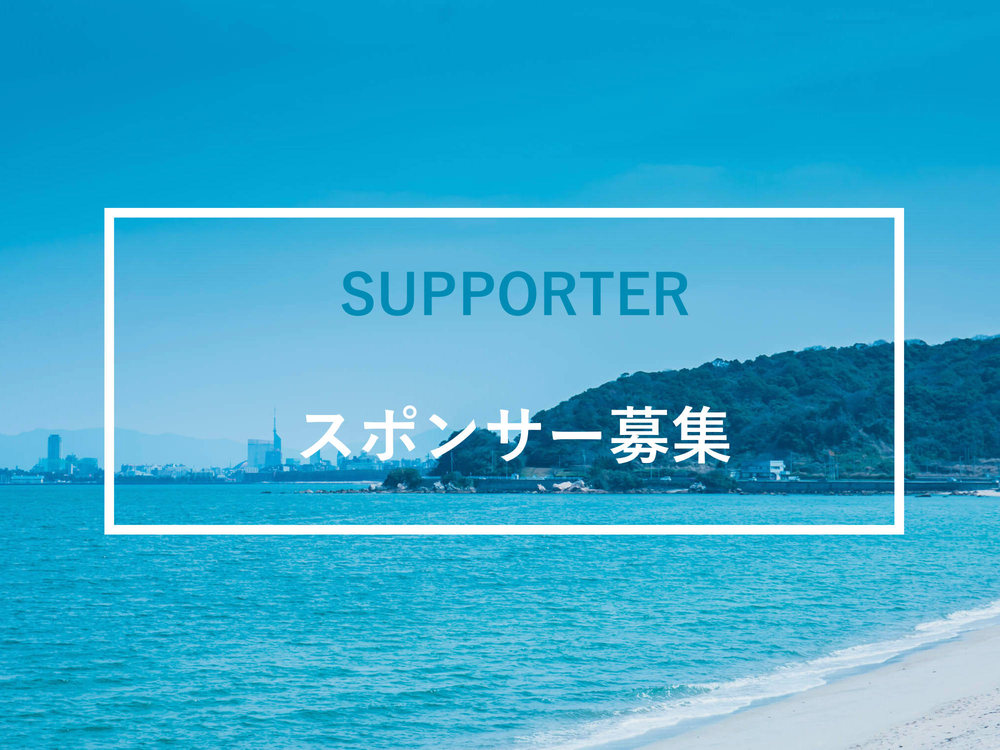

cocono fest. 2017では、本イベントに協賛いただける企業、団体および個人の皆さまを募集しております。

## イベント概要

cocono fest. 2017は、「ここから始まる、九州ミュージックムーブメント」をスローガンに、「KYUSHU POP UP STAGE」を中心とし様々なブースを展開する無料エリアと、有料エリア「COCONO STAGE」を設け実施する音楽フェスティバルです。

本イベントは、九州地区居住者に対する「気軽に音楽を楽しむ」雰囲気の醸成、および九州在住アーティストの支援を目的に、2015年開催の「[SEACOAST SOUNDS FUKUOKA](http://coconofest.asia/2015)」を引き継ぐかたちで開催いたします。

本来的には有料エリアのチケット収入で全ての費用を賄うべきところ、会場（さいとぴあ多目的ホール）のキャパシティ、イベント趣旨に基づいた無料エリアの設置やチケット代金設定等の課題から、チケット収入のみでの運営が厳しい状況です。

つきましては、是非イベント趣旨にご理解を賜り、ご協賛いただきますようお願い申し上げます。
また、資金面に限らず、物品、ブースの設置、企画のコラボレーション等、様々なかたちでご支援賜れましたら幸いです。

九州での音楽・創作文化興隆のため、何卒ご協力を宜しくお願いいたします。

## 無料エリア設置の意義と目的（代表 小宮大輔）

今や多くの音楽が無料で聴ける環境にあります。今後もこの流れが加速し、「音楽は無料で聴くもの」という状況がスタンダードになる将来も近いかもしれません。
しかし、良い音楽に価値を感じ、相応の対価を払う行為や思いがなくなるとは思いません。また何より、音楽を始めとする創作活動発展のためにも無くしてはならないものです。

とはいえ、前述のような環境下で、地方在住の若いアーティストが駆け出すタイミングから有料のライブ活動を重ねていくだけでは、多くの人の目や耳に触れずらいというのが現状です。

cocono fest.実行委員会は、九州で活動しているアーティストの作品を、より多くの人に知ってもらい広げていく場所を実現するため発足しました。また、より多くの作品に触れることができる状況をきっかけに、消費者側の意識改革にもつなげていきたいと考えています。

リスナーにとってもアーティスト側にとっても、「KYUSHU POP UP STAGEから始まり、COCONO STAGEへステップアップ」という流れのなかで、「無料で音楽を楽しむ／楽しませるステージから、対価を支払う／受け取るステージへのステップアップ」が感じられる場所を作ることが目標です。

まだまだ未成熟なイベントではありますが、本趣旨にご賛同いただけるようでしたら、何卒ご支援ご協力のほどよろしくお願いいたします。

<iframe src="https://docs.google.com/forms/d/e/1FAIpQLSdAvbNc1xp7r5xFnJBXK5Gj5H7SvwHeP9qukr14LdO8BH67Rw/viewform?embedded=true" width="100%" height="500" frameborder="0" marginheight="0" marginwidth="0"></iframe>

※お問合せいただきました方へ、より詳細な資料をお送りさせていただきます。

<!--
### 見出し3
*斜体*
**強調**
 
 
>引用引用引用引用引用引用引用引用引用引用引用引用引用引用引用引用引用引用引用引用引用引用引用引用引用引用引用引用

<a href="http://milieu.ink/column/spac" class="source-link" target="_blank">出典リンク</a>

[リンク](http://milieu.ink/column/spac)

<a href="http://milieu.ink/column/spac" class="source-link" target="_blank">出典リンク</a>
リンク[リンク](http://milieu.ink/column/spac)リンク

- リスト
  - リスト
-->
