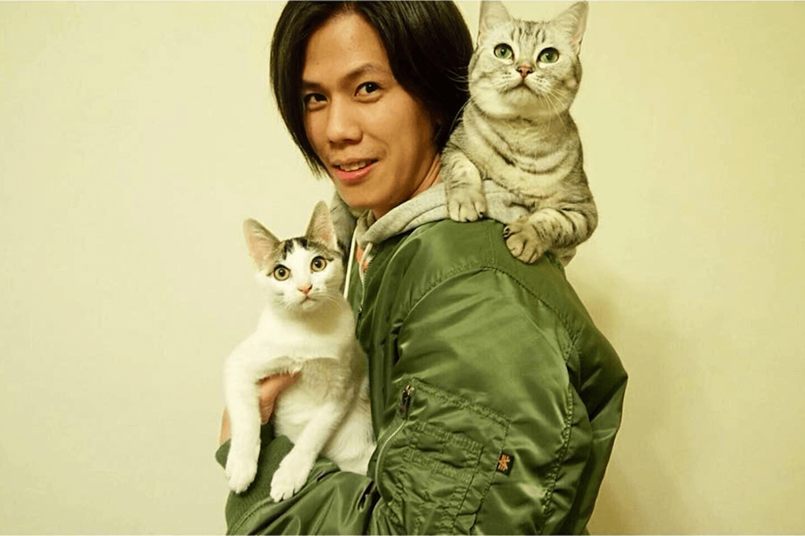
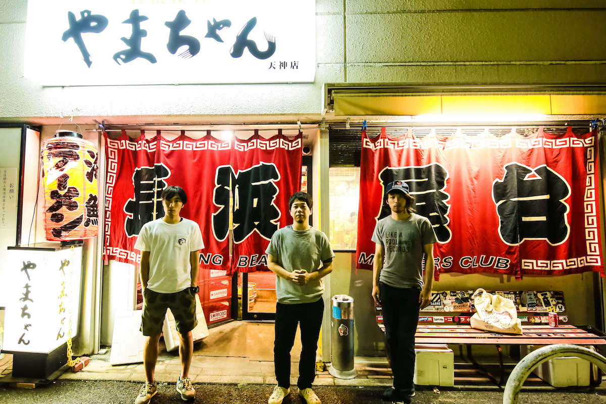
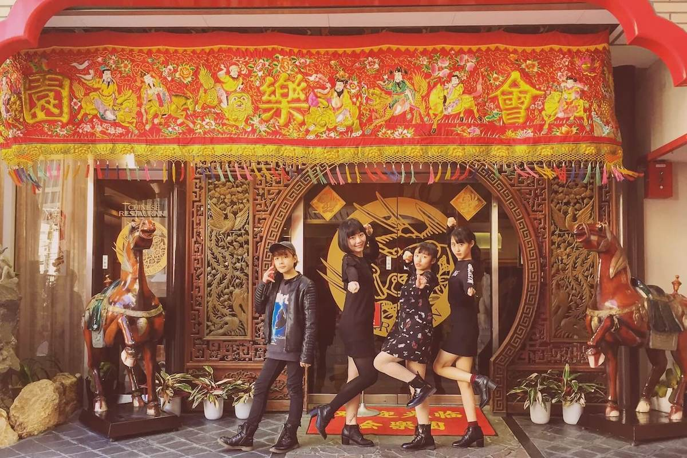

cocono fest.（ココノフェスト）は、九州のアーティストを発信するのみならず、"アジアのアーティストを招聘し、アジアと九州の音楽文化交流を促進する"ことも目的として掲げています。
一昨年開催した[SEACOAST SOUNDS FUKUOKA](http://coconofest.asia/2015/)では、台湾のManic Sheepが出演してくれました。

そして今年。またもや台湾から素敵なアーティストをお招きしました！元・透明雑誌の洪申豪！
福岡からは、大盛況だったBEAT STATIONワンマンも記憶に新しい、IRIKOが出演します。
どちらも、福岡を代表する伝説的バンド・NUMBER GIRLをリスペクトしているという共通点。
熱いライブを繰り広げてくれるに違いありません。

更に、福岡で話題のEDMチーム・Stereo Fukuokaも出演決定！
駅前が常夏のパーティーフロアに変わる瞬間を目撃してください！

## COCONO STAGE

※COCONO STAGEチケットをお持ちの方がご入場いただけます。

### 洪 申豪（ex.透明雑誌） [from 台湾]

### IRIKO [from 福岡]

## KYUSHU POP UP FLOOR

※チケット不要で、どなたでも無料でご覧いただけます。

### Stereo Fukuoka [from 福岡]

各ステージの出演者発表は、次回で最後になります。最後を飾るのはどんなアーティストなのか、みなさん予想してみてください！
それ以降も、アートやフードなどの発表がありますので、お楽しみに！

<a href="/ticket.html" class="page-movement">TICKETページへ</a>

<a href="/lineup.html" class="page-movement">LINE-UPページへ</a>

<!--
*斜体*
**強調**
 
 
>引用引用引用引用引用引用引用引用引用引用引用引用引用引用引用引用引用引用引用引用引用引用引用引用引用引用引用引用

<a href="http://milieu.ink/column/spac" class="source-link" target="_blank">出典リンク</a>

[リンク](http://milieu.ink/column/spac)

<a href="http://milieu.ink/column/spac" class="source-link" target="_blank">出典リンク</a>
リンク[リンク](http://milieu.ink/column/spac)リンク

- リスト
  - リスト

<a href="./2" class="article-next-page">次のページ</a>
-->