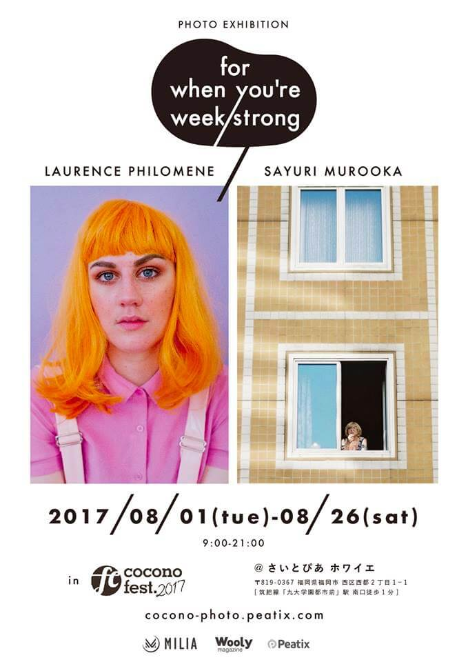
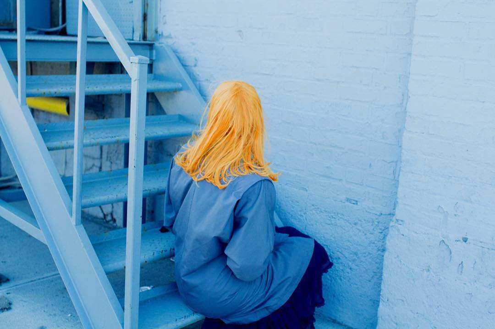
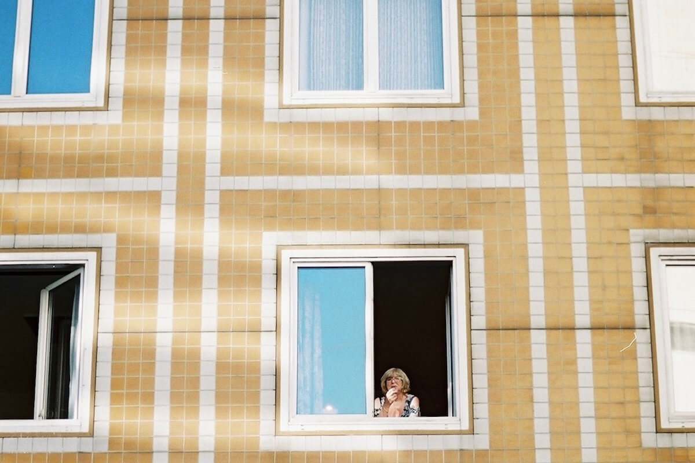

ファッション、アート、音楽、写真、映画など、様々なカルチャーを扱うバイリンガルマガジン/ウェブ媒体『Wooly』とcocono fest.のコラボ展示が決定しました。

今回参加するのは、カナダからLAURENCE PHILOMENE、東京からSAYURI MUROOKAという2人の写真家です。

### LAURENCE PHILOMENE

>Laurence is a 23 year old freelance photographer, director and curator living in Montreal. Mentored by Ivan Shaw (excutive photo director at Vogue) and Curator of the Coven Collective & Camp Gallery. Working around themes of gender identity, softness & color theory. 

### SAYURI MUROOKA

>“Sayuri Murooka, born 1998 in Kanagawa, Japan.
>She has been documenting street scene in Tokyo, as well as London, Paris, and many other countries with film since the start of her career at 16. She started off her career as a fashion snap photographer at Tokyo Fashion Week, and worked for a fashion media. She is fascinated by the many aspects of the tiny moment happening on the street, such as postures, colours, smell, as well as abstract atmospheres and emotions it brings. Other than documenting daily street moment, she started photographing and 
collaborating with talented girls, such as fashion brands, stylists, artists.”
>1998年神奈川県出身。
>人物を主に撮影し、ストリートスナップを得意とする。

Woolyとのコラボ展示『for when you're week strong』は、さいとぴあホワイエにて8月1日（火）〜8月26日（土）まで開催されます。こちらは観覧無料でお楽しみいただけます。
また、同時に<a href="/lineup/2017/art/masuda-miku">masuda miku</a>さんのアート展示も行います。

ブレイク間近の若手の作品を見れる貴重な機会です！ぜひ会場までお越しください！

<a href="/lineup.html" class="page-movement">LINE-UPページへ</a>

<!--
*斜体*
**強調**
 
 
>引用引用引用引用引用引用引用引用引用引用引用引用引用引用引用引用引用引用引用引用引用引用引用引用引用引用引用引用

<a href="http://milieu.ink/column/spac" class="source-link" target="_blank">出典リンク</a>

[リンク](http://milieu.ink/column/spac)

<a href="http://milieu.ink/column/spac" class="source-link" target="_blank">出典リンク</a>
リンク[リンク](http://milieu.ink/column/spac)リンク

- リスト
  - リスト

<a href="./2" class="article-next-page">次のページ</a>
-->