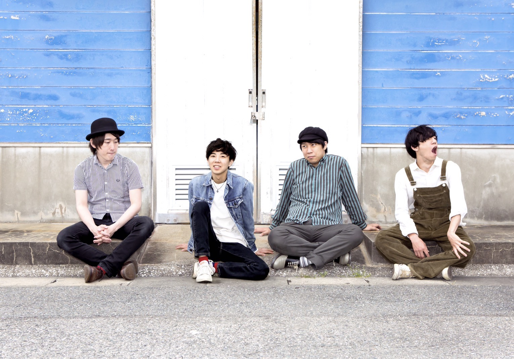
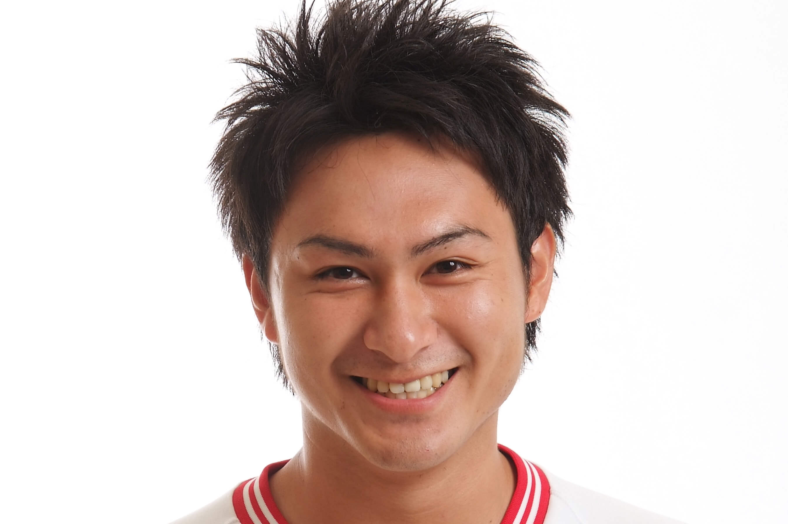

ココノフェストまで1ヶ月を切ったこのタイミングで、HMV&BOOKS HAKATAさんとタッグを組み、観覧無料のプレイベントを行います！
8月のフェス本編にも出演してくださるMC、バンドの皆さん、そしてHMV&BOOKS HAKATAさんのご協力のおかけで、このような場を設けることができました。ありがとうございます！

ココノフェストに関わる人たちの熱や思いを、いち早く体感しに来ませんか？

今回ライブを行うThe Folkeesとabout a ROOMのCD販売（特典がつくかも！？）も行いますので、ぜひ足を運んでみてください！

## 7月23日（日）

- 会場
  - HMV&BOOKS HAKATA店内イベントスペース
- 時間
  - 17:00 - 19:00
- 内容
  - ミニライブ（The Folkees）
  - トークショー（フェストーーク）
    - モデレーター 町田隼人 / スピーカー 小宮大輔（cocono fest.実行委員長）、糸永直幸（The Folkees）、masuda miku ...and more？

### LIVE: The Folkees

### MC: 町田隼人

## 7月30日（日）

- 時間
  - 17:00 - 19:00
- 内容
  - ミニライブ（about a ROOM）
  - トークショー（フェストーーク）
    - モデレーター 坂口カンナ / スピーカー 小宮大輔（cocono fest.実行委員長）、吉原リヨウジ（about a ROOM）、masuda miku ...and more？

### LIVE: about a ROOM

### MC: 坂口カンナ

<a href="http://www.hmv.co.jp/st/event/29900/" target="_blank">HMV&BOOKS HAKATAインストアイベントページへ</a>

cocono fest. 2017のチケットはこちらからご購入ください。
<a href="/ticket.html" class="page-movement">TICKETページへ</a>

<a href="/lineup.html" class="page-movement">LINE-UPページへ</a>

<!--
*斜体*
**強調**
 
 
>引用引用引用引用引用引用引用引用引用引用引用引用引用引用引用引用引用引用引用引用引用引用引用引用引用引用引用引用

<a href="http://milieu.ink/column/spac" class="source-link" target="_blank">出典リンク</a>

[リンク](http://milieu.ink/column/spac)

<a href="http://milieu.ink/column/spac" class="source-link" target="_blank">出典リンク</a>
リンク[リンク](http://milieu.ink/column/spac)リンク

- リスト
  - リスト

<a href="./2" class="article-next-page">次のページ</a>
-->