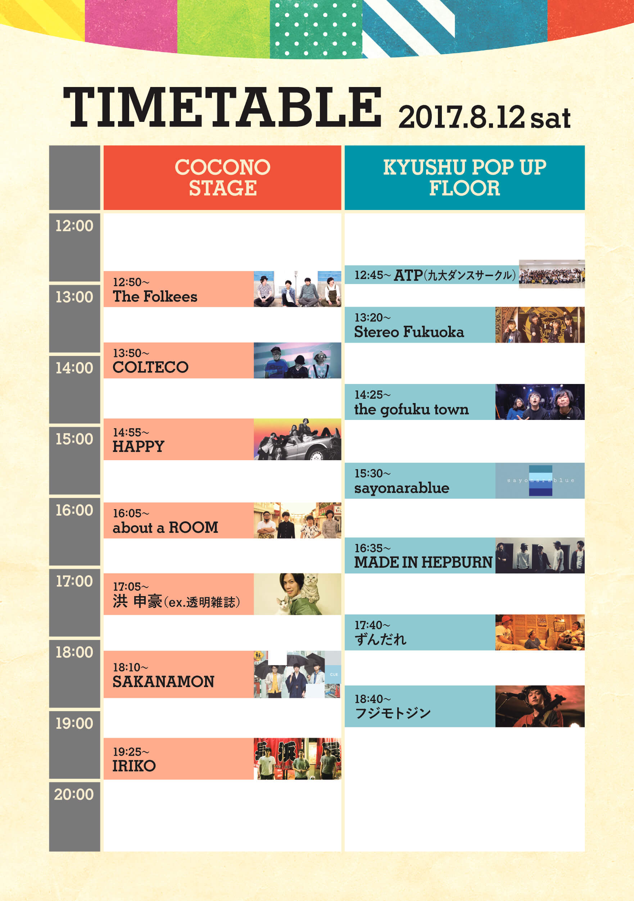

お待たせしました！タイムテーブルを発表します！

KYUSHU POP UP FLOORのトップバッターは、九州大学ダンスサークル・ATPのパフォーマンスからのStereo Fukuoka、ヘッドライナーはフジモトジンにお願いしました。
COCONO STAGEのトップバッターはThe Folkees、ヘッドライナーはIRIKOにお願いしました。

フェスの始まりと終わりを、九州のアーティストにお任せしました。

ココノフェストは九州に密着したフェスです。人気アーティストが沢山出演するようなフェスではありません。
知らないアーティストが多いかもしれません。
それでいいんです。
まずは足を運んでください。無料で観覧できるエリアもありますので。

福岡、九州の次世代アーティストを発掘・発信するフェスとして、この地に根付き、全国でも知られるような存在にしていきます！

cocono fest. 2017のチケットはこちらからご購入ください。
<a href="/ticket.html" class="page-movement">TICKETページへ</a>

<a href="/lineup.html" class="page-movement">LINE-UPページへ</a>

<!--
*斜体*
**強調**
 
 
>引用引用引用引用引用引用引用引用引用引用引用引用引用引用引用引用引用引用引用引用引用引用引用引用引用引用引用引用

<a href="http://milieu.ink/column/spac" class="source-link" target="_blank">出典リンク</a>

[リンク](http://milieu.ink/column/spac)

<a href="http://milieu.ink/column/spac" class="source-link" target="_blank">出典リンク</a>
リンク[リンク](http://milieu.ink/column/spac)リンク

- リスト
  - リスト

<a href="./2" class="article-next-page">次のページ</a>
-->